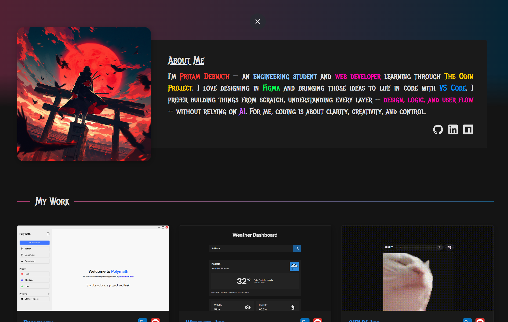

# Portfolio Website

A modern, responsive portfolio website built with React and Tailwind CSS to showcase projects, technical skills, and contact information.

**🌐 Live Demo:** [View Live Site](#) _(Coming Soon)_



## 🚀 Features

- **Responsive Design** - Fully responsive layout that works seamlessly on mobile, tablet, and desktop devices
- **Hero Section** - Eye-catching introduction with avatar and personal information
- **Project Showcase** - Display your projects with images, descriptions, tech stacks, and links to live demos and repositories
- **Tech Stack Section** - Highlight your technical skills and technologies you work with
- **Contact Footer** - Easy-to-find contact information and social links
- **Component Lab** - Isolated environment for testing and developing individual components

## 🛠️ Tech Stack

- **React 19** - UI library for building the interface
- **Vite** - Fast build tool and development server
- **Tailwind CSS 4** - Utility-first CSS framework for styling
- **react-responsive** - Responsive breakpoint management
- **ESLint** - Code linting and quality assurance

## 📦 Installation

1. Clone the repository:

```bash
git clone <your-repo-url>
cd odin-portfolio-site-v2
```

2. Install dependencies:

```bash
npm install
```

3. Start the development server:

```bash
npm run dev
```

4. Open your browser and visit `http://localhost:5173`

## 🏗️ Project Structure

```
src/
├── components/       # Reusable UI components
│   ├── common/      # Shared components (ColoredText, IconContainer, SectionHeader)
│   ├── HeroSection/ # Introduction section with avatar and bio
│   ├── WorkSection/ # Projects showcase section
│   ├── TechStackSection/ # Skills and technologies display
│   ├── Footer/      # Contact information and links
│   └── ComponentLab/ # Component testing environment
├── pages/           # Page components
│   ├── MainPage.jsx       # Main landing page
│   └── ComponentLabPage.jsx # Component testing page
├── data/            # Data files
│   ├── projects.js  # Project information
│   └── techStack.js # Technology stack data
├── constants/       # Constant values
│   └── logoSet.js   # Technology logos and icons
└── assets/          # Static assets (fonts, icons, images)
```

## 📝 Key Components

- **HeroSection** - Displays your introduction, avatar, and key information about yourself
- **WorkSection** - Showcases your projects with cards containing project details, tech stack, and links
- **TechStackSection** - Presents your technical skills in an organized, visual manner
- **Footer** - Contains contact details and ways to reach you
- **ComponentLab** - Development environment for building and testing components in isolation

## � Acknowledgments

This project was built as part of [The Odin Project](https://www.theodinproject.com/) curriculum. Special thanks to The Odin Project community for their excellent resources and guidance.

## 📄 License

This project is licensed under the ISC License - see the [LICENSE](LICENSE) file for details.
